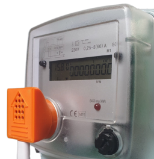
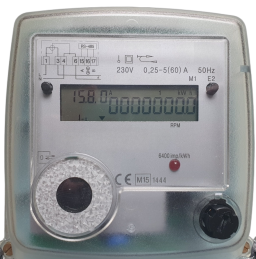
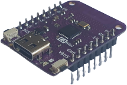
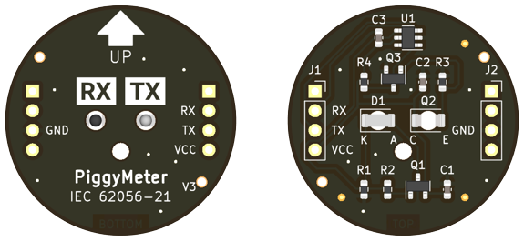
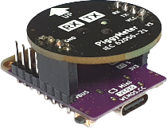
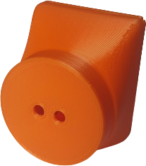
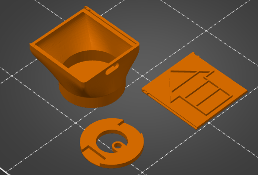
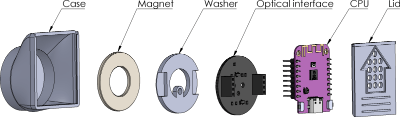
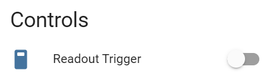
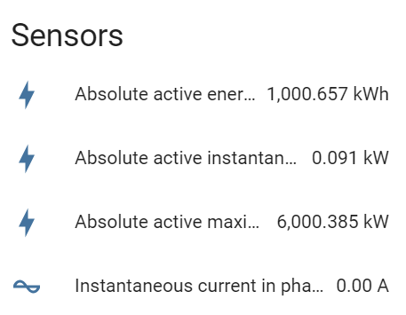

PiggyMeter
==========

    PiggyMeter attached to electric meter

This article shows you how to build a device to remotely 
read data from an electric meter (or any device with a compatible interface).

It uses widely available components, open source software and is compatible 
with popular home automation software, `Home Assistant <https://www.home-assistant.io/>`_.

A kit for assembling a functional device is available for purchase on Tindie: `PiggyMeter KIT <https://www.tindie.com/products/aquaticus/piggymeter-kit/>`_.

Features
********

* **Supports IEC62056-21 based protocols**
* **Multiple meters: energy, water, thermal, and more**
* **Uses open source ESPHome**
* **Wireless communication via Wi-Fi**
* **Integrates with Home Assistant**
* **Cheap hardware ESP32-C3 or ESP32-S2**
* **Case design available for 3D print**

It supports meters compatible with IEC62056-21 standard that works in modes A, B, C, D (but not E). 
For details see :doc:`iec62056`.

Note that there are many variations of the protocol. Although the meter may use the same 
optical interface, the data frame format could be different. 

.. warning::

    SML and DSML standards are not supported.

How to check if the meter is supported?
---------------------------------------

IEC 62056-21 term is used for multiple protocols 
(with the same hardware layer but different data encoding).
The device supports meters that provide ASCII-encoded data, 
something like this:

.. code-block:: console

    1-0:15.8.1(00000009999.567*kWh)
    1-0:15.8.2(00000000000.000*kWh)
    1-0:15.8.3(00000000000.000*kWh)
    1-0:15.8.4(00000000000.000*kWh)

The meter must be compatible with `International Standard IEC 62056-21:2002 <https://webstore.iec.ch/publication/6398>`_.

    Characteristic metal ring and optical interface in the middle.

Bill of materials
*****************

+-------------------+----------------------------------------------------------------------+
| Part              | Description                                                          |
+===================+=====================+================================================+
| CPU               | Wemos C3 or S2 Mini https://www.wemos.cc/en/latest/                  |
+-------------------+----------------------------------------------------------------------+
| Optical interface | PiggyMeter PCB https://www.tindie.com/products/32082/                |
+-------------------+----------------------------------------------------------------------+
| 2×pin header 1×4  | 2.54mm raster; plastic part must be 8.5 mm height                    | 
+-------------------+----------------------------------------------------------------------+
| Ring Magnet       | ⌀30/⌀15×2mm                                                          |
+-------------------+----------------------------------------------------------------------+
| Case              | 3D printed case https://github.com/aquaticus/piggymeter_case         |
+-------------------+----------------------------------------------------------------------+
| Washer            | 3D printed washer https://github.com/aquaticus/piggymeter_case       |
+-------------------+----------------------------------------------------------------------+
| Lid               | 3D printed back lid https://github.com/aquaticus/piggymeter_case     |
+-------------------+----------------------------------------------------------------------+

CPU board
---------

You need a board with Espressif chip installed and compatible Wemos/Lolin pinout. The key factor is location of 4 pins:
`GND`, `VCC`, `TX`, and `RX`. 

The size of the PCB is also critical. 3D printed case matches only boards (or their clones) listed below:

* Lolin/Wemos S2 mini
* Lolin/Wemos C2 mini 

In theory, you can use any other CPU board with compatible pinout, notable ESP32 and ESP8266 D1 mini.
But in that case you must design your own case and modify a bit configuration files
(board type and serial port pins).

Optical interface
-----------------

A meter employs an optical interface compatible with IEC62056-21 standard,
communicating with a probe via an infrared diode and a phototransistor.

The interface is connected to one of the serial ports on CPU board. 
Of course you need VCC and GND too.

    
    Optical interface and CPU board

Solder 2 pin headers. You must use pin header **8.5 mm** height.
The design of the case accommodates this height, ensuring a proper fit.
If the height exceeds this dimension, closing the lid may pose challenges.

You can buy assembled interface on Tindie.

.. raw:: html

    

Case
----

Download files for 3D printer from https://github.com/aquaticus/piggymeter_case.

The casing comprises three components: 

* the main case, 
* a washer, 
* and a lid.

There are three distinct `STL` files available for each component, 
or alternatively, a single `3fm` file incorporating all three elements.

The housing meets the requirements of the :ref:`IEC62056-21 standard<Optical Probe>`.

.. note:: 

    The housing has a small latch. To close or open it, you need to use some force.

Recommended 3D print settings
+++++++++++++++++++++++++++++

* Material: PLA
* Layer: 0.2 mm
* No support

Assembly
********

Arrange the components within the case in this order:

1. Magnet
2. Washer
3. Optical interface
4. CPU board
5. Lid

..  youtube:: fM2LyJJWQHA
    :align: center

Programming
***********

Begin by installing `ESPHome <https://esphome.io/index.html>`_.

Based on your CPU board, select the appropriate configuration file. 
Additionally, make manual adjustments to certain parameters, 
such as the WiFi password.

Get configuration files
-----------------------

Clone git repository with configuration files:

.. code-block:: bash

    git clone https://github.com/aquaticus/piggymeter_esphome_yaml

Create secrets.yaml file
------------------------

Create a `secrets.yaml` file within the directory where the configuration 
files are located. This file will hold the WiFi network name and 
its corresponding password.

.. code-block:: bash
    :caption: Sample secrets file.

    # Home Assistant API encryption key
    api_key: my_home_assistant_encryption_key

    # OTA password
    ota_pass: my_ota_password

    # WiFi network name
    wifi_ssid: my_network

    # WiFi network password
    wifi_pass: my_password

Modify project configuration
----------------------------

The configuration comes pre-set with standard data points for 
an electric meter.

Feel free to adjust the list, especially if your meter differs 
from the electric meter type. Refer to the :doc:`iec62056` for further 
information.

.. code-block:: yaml
    :caption: Sample sensor definition 

    sensor:
       - platform: iec62056
           obis: 1-0:15.8.0
           name: Absolute active energy total
           unit_of_measurement: kWh
           accuracy_decimals: 3
           device_class: energy
           state_class: total_increasing

Build and flash the firmware
----------------------------

.. code-block:: bash
    :caption: Build for S2 target 

    esphome run piggymeter-s2-iec62056-21.yaml

The command above flashes the firmware and show monitor output.
By default, the interface reads data from a meter every 1 minute.

.. code-block:: console
    :caption: Sample meter readout in the log

    [12:21:27][D][iec62056.component:232]: Connection start
    [12:21:27][D][binary_sensor:036]: 'Meter Connection Status': Sending state ON
    [12:21:28][D][switch:013]: 'Internal LED' Turning ON.
    [12:21:28][D][switch:056]: 'Internal LED': Sending state ON
    [12:21:28][D][iec62056.component:174]: Meter identification: '/XXX6\2YYYYY'
    [12:21:28][D][iec62056.component:407]: Meter reported protocol: C
    [12:21:28][D][iec62056.component:410]: Meter reported max baud rate: 19200 bps ('6')
    [12:21:28][D][iec62056.component:438]: Using negotiated baud rate 9600 bps.
    [12:21:29][D][iec62056.component:470]: Switching to new baud rate 9600 bps ('5')
    [12:21:29][D][iec62056.component:482]: Meter started readout transmission
    [12:21:29][D][iec62056.component:524]: Data: 0-0:C.1.0(12345678)
    [12:21:29][D][iec62056.component:524]: Data: 0-0:1.0.0(2000-01-01 20:10:30)
    [12:21:29][D][iec62056.component:524]: Data: 1-0:15.8.0(00000001000.657*kWh)
    [12:21:29][D][iec62056.component:620]: Set sensor 'Absolute active energy total' for OBIS '1-0:15.8.0'. Value: 1000.656982
    [12:21:29][D][iec62056.component:524]: Data: 1-0:15.8.1(00000002000.657*kWh)
    [12:21:29][D][iec62056.component:524]: Data: 1-0:15.8.2(00000003000.000*kWh)
    [12:21:29][D][iec62056.component:524]: Data: 1-0:15.8.3(00000004000.000*kWh)
    [12:21:29][D][iec62056.component:524]: Data: 1-0:15.8.4(00000005000.000*kWh)
    [12:21:29][D][iec62056.component:524]: Data: 1-0:15.6.0(00000006000.385*kW)(2000-01-01 20:10:01)

Home Assistant
**************

The device should be automatically detected by Home Assistant. 
If not, you can add it manually by clicking `Add Integration` and selecting `ESPHome` integration.

PiggyMeter exposes three group of items:

Readout Trigger
---------------

This trigger force PiggyMeter to read data from a meter out of the schedule.

Meter Connection Status
-----------------------

`Connected` status indicates the interface is exchanging data with the meter.

Sensors
-------

This is a list of sensors defined in configuration file.

Modifications
*************

By default, the device fetches data every minute, 
and the internal LED is illuminated during transmission.

Only limited number of :abbr:`OBIS (Object Identification System )` 
codes are defined in configuration yaml file. It is highly recommended
to modify the list of sensors to mach a meter. 

Although OBIS codes are standardized, meters may transmit 
varying numbers of codes. To ascertain the supported codes for 
your meter, enable `DEBUG` logging for the `iec62056` component and 
analyze the log output.

Diagnostic and Problems
***********************

After flashing the firmware, the device will attempt to read data 
from a meter after approximately 15 seconds. If the transmission 
fails, it will retry twice every 15 seconds.

You can adjust these parameters by configuring the appropriate tokens. 
Consult :doc:`iec62056` documentation for more details.

It's advisable to switch the default log level from ``DEBUG`` to ``INFO`` 
once the device has been confirmed to work correctly.

Below are common issues and their respective solutions.

.. note:: 
    Ensure the probe is securely attached to the meter, 
    aligning the arrow on the probe in an upward direction.

No transmission from meter
--------------------------

.. code-block:: bash
    :caption: Error log

    [E][iec62056.component:268]: No transmission from meter.

This may indicate:

* Most commonly, the interface is not attached to a meter.
* The interface isn't properly aligned with the optical interface of a meter.
* The meter is not compatible.

Make sure that the optical interface is positioned parallel to the front surface 
of the housing. If the device works when attached to the meter without the housing, 
but doesn't work after being inserted into the housing, this could be the issue. 
In such a case, you may also consider **enlarging** the two holes in the housing. 

Not all sensors received data
-----------------------------

.. code-block:: bash
    :caption: Error log

    [E][iec62056.component:644]: Not all sensors received data from the meter. The first one: OBIS '1-0:72.7.0'. Verify sensor is defined with valid OBIS code.

This may indicate two problems:

* The meter does not support OBIS code you configured in `yaml` file. Simply remove sensor with specific OBIS code from configuration.
* There might be a typo or incorrect definition of the OBIS code for the sensor in the configuration file. Double-check the code.

The meter transmits data automatically but the device receives nothing
----------------------------------------------------------------------

This indicates the meter supports *mode D* of IEC62056-21.
In this mode, the meter autonomously transmits data every few seconds 
without requiring a specific request. Ensure that the serial port is 
configured to align with the meter's transmission format, 
typically set at `9600 7E1` or `2400 7E1` in most instances.

.. code-block:: yaml

    # 9600bps for mode D
    uart:
        rx_pin: GPIO21
        tx_pin: GPIO22
        baud_rate: 9600
        data_bits: 7
        parity: EVEN
        stop_bits: 1

In addition, Mode D must be manually activated by setting `mode_d=True` in the platform configuration.

.. code-block:: yaml

    # Enable mode D
    iec62056:
      mode_d: True

Checksum errors
---------------

.. code-block:: bash
    :caption: Error log

    [E][iec62056.component:504]: BCC verification failed. Expected 0x6b, got 0x14

This error suggests transmission issues.

Usually, the transmission speed is excessively high.
Lowering the maximum baud rate should help.

.. code-block:: yaml

    iec62056:
      baud_rate_max : 4800
