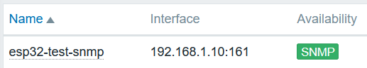

ESPHome network monitoring
==========================

ESPHome is a popular system to control Espressif ESP8266 and ESP32 devices. This article describes how to monitor multiple devices using a custom ESPHome SNMP component and a popular network monitoring tool.

Thanks to that, you can detect and be informed about anomalous behaviors of your devices, like reboots, low WiFi signal, or lack of free memory.

SNMP is supported by many applications, but this article discusses integration with the open source tool Zabbix. It is assumed you have Zabbix version 6.4 installed and running.

.. note::
   Zabbix installation guide is available on Zabbix web page: `https://www.zabbix.com/download <https://www.zabbix.com/download>`_

SNMP Component
--------------

ESPHome does not support SNMP out of the box. But it provides a convenient
way to integrate with external components.

To add SNMP protocol to ESPHome device reference SNMP Component located in https://github.com/aquaticus/esphome, branch ``aquaticus-snmp``.

Add the following code to your ESPHome YAML configuration file:

.. code-block:: yaml

   # Enable SNMP component
   snmp:

   # Retrieve SNMP component from github
   external_components:
      - source: github://aquaticus/esphome@aquaticus-snmp
        components: [ snmp ]

When uploaded to a board you should see the following message in the
log:

::

   [00:00:00][C][snmp:268]: SNMP Config:
   [00:00:00][C][snmp:269]:   Contact: ""
   [00:00:00][C][snmp:270]:   Location: ""

Testing SNMP
------------

Now you can try to retrieve some information from the board.
There are plenty of programs that can browse SNMP data. Here are some examples:

Windows
~~~~~~~

-  MIB Browser https://www.ireasoning.com/mibbrowser.shtml
-  Paessler SNMP Monitor https://www.paessler.com/snmp_monitor

Linux
~~~~~

-  **snmpget** https://linux.die.net/man/1/snmpget

Here is a sample code to use on Linux. Replace IP address `192.168.1.10` to a value matching the address of your board. 

.. code-block:: 

   snmpget -v2c -c public 192.168.1.10 1.3.6.1.2.1.1.1.0

The result of the above query looks like the one below. It is
a description of the system. It is SMTP object ``sysDescr`` which
translates to ``1.3.6.1.2.1.1.1.0`` object ID.

.. code-block:: 

   iso.3.6.1.2.1.1.1.0 = STRING: "ESPHome version 2023.3.2 compiled Mar 29 2023, 00:00:01, Board wemos_d1_mini32”

Optionally you can try to get system uptime.

.. code-block::

   snmpget -v2c -c public 192.168.1.10 1.3.6.1.2.1.25.1.1.0

The result:

.. code-block:: 

   iso.3.6.1.2.1.25.1.1.0 = Timeticks: (66281) 0:11:02.81

The time ticks value is changing continuously. Every call gives you
different number.

For a list of all objects provided by SNMP component, see component
documentation.

Templates
---------

Download the template file from: https://github.com/aquaticus/esphome_zabbix_templates

It consists of 3 templates:

-  `Esphome by SNMP` - base template
-  `Esphome ESP32 by SNMP` - template for ESP32 devices (including C3,
   S2 and so on)
-  `Esphome ESP8266 by SNMP` - template for ESP8266

The main difference between ESP8266 and ESP32 templates is heap data.

Import template file clicking ``Import`` button in Data collection→Templates.

Hosts
-----

Open Zabbix interface and go to Monitoring→Hosts. Click ``Create host``
in the top right corner.

1. As a template select `Esphome ESP32 by SNMP` or
   `Esphome ESP8266 by SNMP`
2. Add ``SNMP`` interface.
3. Fill IP or DNS fields
4. Leave the rest of the fields with default values.
5. At the end click ``Add`` button.

On the list of monitored hosts (Monitoring→Hosts) you should see a new
entry.

There will be ``SNMP`` icon in the ``Availability`` column. Initially, it
will be greyed but after a couple of seconds, it should turn green.

Monitoring
----------

Once you see the green icon you can examine SNMP Data.

If you click on ``Latest data`` link you'll see the list of collected
items.

Alarms
------

Zabbix can automatically detect anomalous situations. In Zabbix
terminology, it is called "Trigger". ESPHome template ships with triggers
that detects typical problems, for example, the board was reset. For a
list of available triggers select ``Triggers`` from the menu when you click
the host name.

Here is a default list of triggers:

-  Firmware has changed
-  High ICMP ping loss
-  High ICMP ping response time
-  Unavailable by ICMP ping
-  The host has been restarted
-  No SNMP data collection
-  The system name has changed
-  Weak WiFi Signal for 5m
-  WiFi connection lost

You can also create your triggers, for example, to monitor heap usage.

.. _Network uptime:

Network uptime
--------------

SNMP Component can provide network uptime (SNMP object ``sysUpTime``
``1.3.6.1.2.1.1.3``). This parameter is crucial to detect connection
loss events.

Unfortunately ESPHome WiFi component does not provide this information.
Because of that by default SNMP Component reports always ``sysUpTime``
as 0.

To get meaningful data you must modify the original WiFi component and add
one function.

You can do it manually or use the one already modified from the
repository.

Repository version
~~~~~~~~~~~~~~~~~~

This is the easiest way. Just add a section to your YAML file and you are
done.

The version of WiFi component is based on ESPHome ``2023.3.2``

Add the following part to ESPHome WiFi component:

.. code-block:: yaml

   external_components:
      # SNMP component
      - source: github://aquaticus/esphome@aquaticus-snmp
        components: [ snmp ]
      
      # Extended WiFi component
      - source: github://aquaticus/esphome@aquaticus-snmp-wifi
        components: [ wifi ]

Manually modify WiFi component
~~~~~~~~~~~~~~~~~~~~~~~~~~~~~~

Clone and install ESPHome from github.

Edit two files ``wifi_component.cpp`` and ``wifi_component.h`` in
``esphome/components/wifi`` directory.

In line 282 of ``wifi_component.h`` add two lines (it can be anywhere in
public section):

.. code-block:: cpp

   #define WIFI_CONNECTED_TIMESTAMP_AVAILABLE
     uint32_t wifi_connected_timestamp() {return connected_timestamp_;}

    protected:
     uint32_t connected_timestamp_{0};

In ``wifi_component.cpp`` add in line 518 just before “WiFi Connected”
log message:

.. code-block:: cpp

   this->connected_timestamp_ = millis();

Test network uptime
~~~~~~~~~~~~~~~~~~~

Compile and upload new firmware.

Now when you read ``sysUpTime`` ``1.3.6.1.2.1.1.3`` object you should
get different values every time get operation is performed.

.. code-block:: 

   snmpget -v2c -c public 192.168.1.10 1.3.6.1.2.1.1.3.0

You should see a value different than 0.

.. .. code-block::

   iso.3.6.1.2.1.1.3.0 = Timeticks: (28052452) 3 days, 5:55:24.52

List of available OIDs
----------------------

To see a full list of objects provided by ESPHome SNMP Component see :ref:`OID`.
